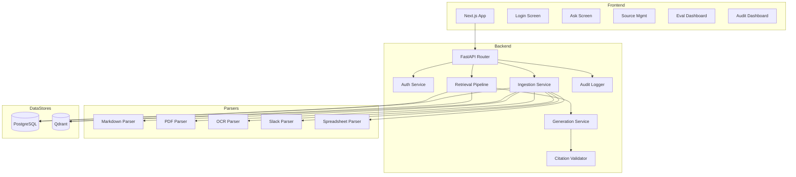

# SecureSource RAG — Architecture Narrative

## System Overview

SecureSource RAG is a three-tier application consisting of a Next.js frontend, FastAPI backend, and two data stores (PostgreSQL and Qdrant).

## Component Architecture

## Data Flow

1. **Ingestion:** Documents are parsed by format-specific parsers, chunked using source-aware strategies, embedded using sentence-transformers, and indexed into both Qdrant (vectors + ACL payloads) and PostgreSQL (metadata + FTS)

2. **Retrieval:** User queries are processed through authentication, ACL filter construction, dual-path retrieval (dense + keyword), RRF fusion, deduplication, cross-encoder reranking, and final ACL verification

3. **Generation:** Authorized chunks are assembled into a security-hardened prompt, sent to the LLM, and the response is validated for citation accuracy before delivery

4. **Audit:** Every interaction is logged with user identity, retrieved chunks, access decisions, and performance metrics

## Security Architecture

The security boundary is at the retrieval layer. ACLs are enforced at three points:
1. Qdrant payload filter during vector search
2. PostgreSQL WHERE clause during keyword search
3. Python verification gate before context construction

This ensures unauthorized content never enters the LLM context.
